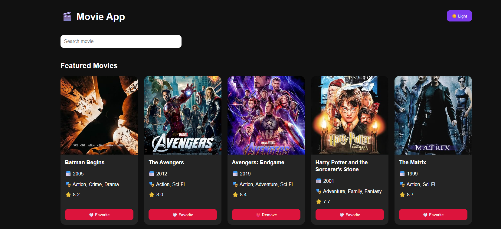

<h1 align="center">Movie Discovery App</h1>

<p align="center">
  
  
  
  
</p>
<p align="center">
  
</p>

# 🎬 Movie Discovery App

A modern React application that allows users to discover trending movies, search by title, save favorites, and enjoy a clean responsive movie browsing experience.

## Live Demo

https://react-movie-app-inky-iota.vercel.app/

---

## Overview

This project was built using React and Vite to create a responsive movie browsing application.

Users can search movies, browse trending titles, save favorites, and switch between light and dark themes while enjoying a fast and modern user experience.

---

## Features

- Movie Search
- Trending Movies
- Favorites
- Dark Mode
- Responsive Design
- Local Storage
- API Integration
- Reusable React Components

---

## Tech Stack

- React
- JavaScript
- Vite
- OMDb API
- HTML5
- CSS3
- Local Storage
- Vercel

---

## What I Built

I developed the application using React and reusable components.

My work included:

- Integrating the OMDb API
- Building reusable components
- Implementing movie search
- Creating favorites functionality
- Persisting favorites with Local Storage
- Implementing Dark Mode
- Building responsive layouts
- Deploying with Vercel

---

## Challenges

The biggest challenges included:

- Working with asynchronous API requests
- Managing application state
- Persisting data with Local Storage
- Creating reusable components
- Building a responsive layout

---

## What I Learned

Through this project I strengthened my understanding of:

- React
- API Integration
- useState
- useEffect
- Local Storage
- Component Architecture
- Responsive Design

---

## Installation

```bash
git clone https://github.com/MRP8490/React---Movie---app.git
```

```bash
cd React---Movie---app
```

```bash
npm install
```

```bash
npm run dev
```

---

## Future Improvements

- Add TypeScript
- Improve Accessibility
- Add Unit Testing
- Improve Performance
- Add GitHub Actions

---

## Author

**Mona Hadizadeh**

Portfolio

https://mona-portfolio-chi.vercel.app

LinkedIn

https://www.linkedin.com/in/mona-r84/

GitHub

https://github.com/MRP8490
